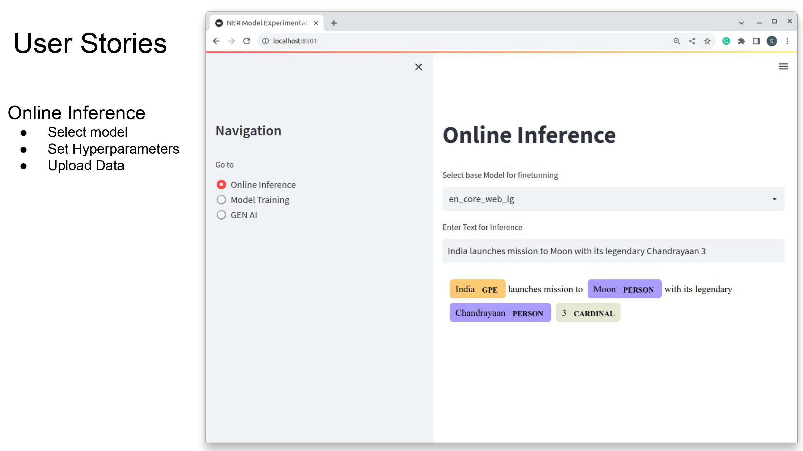

# auto_ner
End to End application for Custom Named Entity Recognition. 
Highlights: 
1. Powerd by GenAi 
2. Few shot Learning 
3. Training and inference pipelines

## Installation
run following command in terminal
```bash
pip install auto-ner
```

## Usage
```bash
auto_ner.run
```
- Above command will lauch the app on default port 8501. 
- Open the browser and go to http://localhost:8501
- Select the image and then select the appropriate set of operations you want to perform on that perticular image. 
- play with the parameters interatively untill you reach at optimal configuration.

```bash
auto_ner.run --port 8080
```
Above command can be used to specify the port on which you want to run the app.

## Application Workflow


## System Architecture


## Demo


## Solution is implemnted in following three steps 
1. Create the baseline
    Spacy Model ([Transformer implementation on Hold])
2. Meet the Expectations
    Training Bert ([ToDo])
3. Exeed the expectations
    - Few shot / Zero Shot NER
    - Beyond mere NER : entyity linking ([ToDo])
    
Development tools:

1. setuptools (https://pypi.org/project/setuptools/): Used to create a python package
2. pipreqs (https://pypi.org/project/pipreqs/): Used to create requirements.txt file
3. twine (https://pypi.org/project/twine/): Used to upload the package to pypi.org
4. Github Actions (): Used to automate the process of uploading the package to pypi.org
5. pytest (https://pypi.org/project/pytest/): Used to write unit tests
6. wheel (https://pypi.org/project/wheel/): Used to create a wheel file

